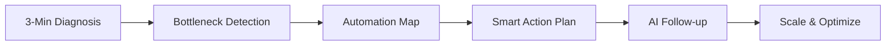

# Renaissance AI - Business Automation Solutions

## 🚀 What We Do

We transform businesses by identifying operational bottlenecks and implementing intelligent automation solutions. Our platform acts as your strategic copilot, helping you scale without friction while freeing your team from repetitive tasks.

### ⚡ Quick Results
- **15 days** to see real automation results
- **3-minute** express diagnosis
- **2 hours/week** time investment from your team

## 🎯 Our Solution

### The Strategic Copilot Platform

## 🔧 Core Modules

| Module | Description | Impact |
|--------|-------------|---------|
| 🔍 **Auto Diagnosis** | Smart questionnaire detects operational issues | Identify problems in minutes |
| 📊 **Problem Dashboard** | Visual map of bottlenecks and opportunities | Clear priorities |
| 🗺️ **Automation Roadmap** | Shows what to automate first (impact vs effort) | Strategic execution |
| 📋 **Smart Action Plan** | Clear, delegatable tasks for your team | Immediate next steps |
| 🤖 **AI Copilot** | Intelligent follow-up and progress tracking | Stay on track |

## 🛠️ Technologies We Integrate

- **Conversational AI**: ChatGPT, Botpress
- **Automation**: Make, Zapier
- **Business Tools**: CRM, Notion, Google Workspace
- **WhatsApp Business API**: Customer communication
- **Custom Integrations**: Odoo, and more

## 📈 Implementation Process

### Phase 1: Discovery (Week 1)
- Express diagnosis questionnaire
- Operational bottleneck analysis
- Opportunity mapping and prioritization

### Phase 2: Strategy (Week 2)
- Personalized automation roadmap
- ROI projections and timeline
- Strategic implementation meeting

### Phase 3: Execution (Weeks 3-4)
- AI system activation
- Automation implementation
- Team training and handoff

### Phase 4: Optimization (Ongoing)
- Quarterly check-ins
- Performance monitoring
- Continuous improvement

## 🎯 Key Hypotheses We're Validating

### About Our Clients
- ✅ Business leaders have unresolved process inefficiencies
- ✅ They're open to AI/automation when it's simple and results-focused
- ✅ They value systems that automate, suggest, and accompany without hiring more people

### About Our Service
- 🔄 "Strategic copilot" value proposition is understood and desired
- 🔄 Modular, customizable, friction-free solutions are preferred
- 🔄 Combined diagnosis + execution + intelligent follow-up increases perceived value

## 📊 Current Market Validation

We're actively validating:
- Most painful and urgent processes to automate
- Preferred delivery format (dashboard, consulting, self-service)
- Expected level of support and guidance
- Optimal pricing models and value perception

## 🔗 Quick Links

- 📋 [Privacy Policy](privacy-policy.md)
- 📞 **Contact**: lauraitz@renaissanceai.mx
- 💬 **WhatsApp Business**: [Coming Soon]
- 🌐 **Website**:[ In Development](https://adaptive-renaissance-web.lovable.app/)

## 🚀 Get Started

Ready to transform your business operations?

1. **Take the 3-minute diagnosis** → [Contact us]
2. **Schedule a strategic call** → [Book now]
3. **See your automation roadmap** → [Get started]

## 📋 Case Studies

### Current Projects
- **SOMA Holdings**: Multi-location business automation strategy
- **Neoma**: Digital channel optimization and CRM implementation
- **Internal Operations**: Dogfooding our own automation solutions

## 🔐 Security & Compliance

- End-to-end encryption for all data
- GDPR, CCPA, and Mexican data protection compliance
- Regular security audits and vulnerability assessments
- Secure API integrations with enterprise-grade providers

## 🌟 Why Choose Renaissance AI?

| Traditional Approach | Renaissance AI Approach |
|---------------------|------------------------|
| ❌ Random process automation | ✅ Strategic diagnosis first |
| ❌ Complex, lengthy implementations | ✅ Results in 15 days |
| ❌ High team involvement required | ✅ Just 2 hours/week |
| ❌ One-size-fits-all solutions | ✅ Personalized automation roadmap |
| ❌ Setup and forget | ✅ Intelligent ongoing optimization |

## 🚧 Roadmap

### Q3 2025
- [ ] WhatsApp Business API full integration
- [ ] Enhanced diagnostic AI algorithms
- [ ] Self-service dashboard launch

### Q4 2025
- [ ] Advanced analytics and reporting
- [ ] Multi-language support
- [ ] Partner ecosystem expansion

## 🤝 Contributing

This is a private repository for Renaissance AI's business automation platform. For business inquiries, partnership opportunities, or client onboarding, please contact our team.

## 📄 License

This project and its documentation are proprietary to Renaissance AI. All rights reserved.

---

**Renaissance AI** - Transforming businesses through intelligent automation
*Simple. Fast. Powerful.*