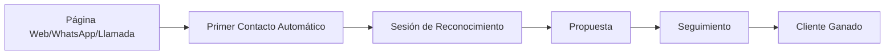

# Portafolio de Agentes de IA

**Date:** 2025-07-21
**Author:** Equipo RAI
**Recipient:** Isaías
**Type:** Technical Documentation
**Status:** #active

---
## Metadatos del Documento

**Propósito:** Descripción detallada de las tecnologías y agentes automatizados desarrollados para comercialización
**Versión:** 1.0
**Última actualización:** 2025-07-21
**Equipo responsable:** Renaissance AI

---
## RESUMEN EJECUTIVO

Nuestro equipo ha desarrollado un ecosistema de agentes de inteligencia artificial especializados que automatizan procesos críticos de negocio. Cada agente está diseñado para resolver problemas específicos del flujo de trabajo empresarial, desde la generación de propuestas hasta el seguimiento de clientes y la gestión documental.

---
## 1. AGENTE DE PROPUESTAS COMERCIALES

### Estado de Desarrollo
**✅ COMPLETADO** - Versión funcional lista para implementación

### Descripción General
Sistema automatizado que genera propuestas comerciales personalizadas a partir de datos de leads, reduciendo significativamente el tiempo de respuesta comercial.

### Funcionalidades Implementadas
- [x] Integración con Google Meet para detección automática de llamadas
- [x] Generación automática de documentos en PandaDoc
- [x] Envío automatizado de seguimiento post-llamada
- [x] Extracción y procesamiento de puntos clave de reuniones
- [x] Generación de resúmenes ejecutivos con tareas asignadas

### Stack Tecnológico
- **Orquestación:** Make (plataforma low-code)
- **Documentación:** PandaDoc API
- **Comunicación:** Gmail API, Google Meet API
- **Procesamiento:** GPT-4o para análisis de contenido

### Métricas de Valor
> [!success] KPIs Clave
> - ⏱️ **Tiempo de respuesta:** < 2 minutos desde lead hasta propuesta
> - 💰 **Ahorro operativo:** 30 minutos por propuesta comercial
> - 📊 **Tasa de éxito:** +90% sin intervención humana
> - 🎯 **Precisión:** Sistema de logging completo para seguimiento

---
## 2. AGENTE DE GENERACIÓN DE PRESENTACIONES

### Estado de Desarrollo
**🔄 EN DESARROLLO** - Flujo de trabajo establecido, pendiente refinamiento

### Descripción General
Automatización completa del proceso de creación de presentaciones corporativas mediante formularios inteligentes y generación con IA.

### Funcionalidades Implementadas
- [x] Formulario dinámico para captura de requisitos
- [x] Integración con Gamma para generación automática
- [x] Conversión automática PDF a PowerPoint
- [x] Sistema de plantillas personalizables

### Proceso de Trabajo
```
1. Cliente completa formulario web con temática y contexto
   ↓
2. Sistema procesa información y genera presentación en Gamma
   ↓
3. Conversión automática a formato PowerPoint
   ↓
4. Entrega automatizada al cliente
```

### Recursos Disponibles
- [[Tutorial Gamma - Enlaces]] 
- [[Demo Francisco - Presentaciones]]
- [[Documentación Técnica Gamma]]

> [!info] Estado Actual
> Demo funcional desarrollado por Francisco, workflow establecido, pendiente optimización para producción.

---
## 3. SISTEMA DE CRM AUTOMATIZADO

### Estado de Desarrollo
**✅ IMPLEMENTADO** - Chatbot activo, CRM en fase de expansión

### Descripción General
Plataforma integrada de gestión de relaciones con clientes que automatiza la captura, seguimiento y gestión de leads desde múltiples canales.

### Componentes Desarrollados

#### 3.1 Chatbot de WhatsApp Business
- **Estado:** ✅ Operativo y funcional
- **Capacidades:** Conexión con cualquier CRM empresarial
- **Integración:** Número empresarial + correo institucional

#### 3.2 Sistema de Seguimiento Inteligente
- [x] Detección automática de nuevos contactos (correo, WhatsApp, redes sociales)
- [x] Registro automático en base de datos centralizada
- [x] Sistema de recordatorios programados
- [x] Seguimiento de estatus de clientes

### Flujo de Trabajo del CRM


> [!tip] Capacidad Actual
> Sistema activo con WhatsApp Business integrado. Puede conectarse con cualquier CRM empresarial existente mediante APIs.

---
## 4. SISTEMA DE GESTIÓN DOCUMENTAL INTELIGENTE

### Estado de Desarrollo
**✅ FUNCIONAL** - Sistema base implementado, en expansión

### Descripción General
Automatización completa de la organización y categorización de documentos empresariales mediante IA.

### Funcionalidades Core
- [x] Generación automática de resúmenes de reuniones
- [x] Integración con Google Drive
- [x] Sistema de categorización automática
- [x] Estructura organizacional predefinida

### Estructura de Archivos Automatizada
```
📁 Google Drive (Raíz)
├── 📁 ADN Empresa
├── 📁 Agentes
├── 📁 Alianzas
├── 📁 Branding/Marketing
├── 📁 Certificación
├── 📁 Finanzas
├── 📁 Juntas
├── 📁 Clientes
├── 📁 Plantillas R.AI
├── 📁 Producto/Servicio
├── 📁 R&D
└── 📁 Recursos Humanos
```

### Capacidades de Procesamiento
- **Clasificación automática:** Por contexto y palabras clave
- **Procesamiento local:** MCP de file system
- **Análisis de contenido:** Mediante LLM
- **Archivo automático:** En carpetas correspondientes

> [!note] Automatización Inteligente
> El sistema puede clasificar y mover documentos automáticamente usando análisis de contexto. Ideal para empresas que manejan grandes volúmenes de documentación.

---
## 5. AGENTE DE FACTURACIÓN AUTOMATIZADA

### Estado de Desarrollo
**💡 CONCEPTUALIZADO** - Especificaciones técnicas definidas

### Descripción General
Sistema que automatiza el proceso completo de generación de facturas a partir de solicitudes de clientes.

### Flujo Propuesto
1. **Recepción:** Solicitud de factura del cliente
2. **Conexión:** Automática con plataforma de facturación
3. **Autocompletado:** Datos del cliente
4. **Verificación:** Un clic para aprobar
5. **Envío:** Automático al cliente

### Integraciones Planificadas
- [ ] Facturama API
- [ ] SAT México
- [ ] Sistemas ERP empresariales
- [ ] Notificaciones automáticas

> [!warning] En Desarrollo
> Este agente está en fase de especificación técnica. Requiere validación con plataformas de facturación mexicanas.

---
## 6. SISTEMA DE NEWSLETTER INTELIGENTE

### Estado de Desarrollo
**🔄 PLANIFICADO** - Conceptualización avanzada

### Descripción General
Generación automatizada de boletines especializados por sector industrial con contenido curado por IA.

### Capacidades Planificadas
- [ ] Análisis de tendencias por sector específico
- [ ] Curación automática de noticias relevantes
- [ ] Personalización por audiencia objetivo
- [ ] Programación y envío automatizado

### Ejemplo de Especialización
**Sector Restaurantero:** Análisis automático de innovaciones, tecnologías emergentes y tendencias del mercado gastronómico.

### Casos de Uso
- Empresas tecnológicas → Tendencias en IA y automatización
- Sector salud → Innovaciones médicas y regulaciones
- Retail → E-commerce y experiencia del cliente

---
## ARQUITECTURA TÉCNICA GENERAL

### Componentes por Agente

| Componente | Función | Ejemplo |
|------------|---------|---------|
| **Identificador** | Nombre técnico del agente | `rai-agent-propuestas-v1` |
| **Área** | Departamento objetivo | Ventas/Marketing/Soporte |
| **LLM** | Motor de procesamiento | GPT-4o, Claude |
| **Orquestación** | Plataforma de automatización | Make, LangChain |
| **APIs** | Integraciones externas | Google Docs, Notion, Gmail |
| **Logging** | Sistema de seguimiento | Google Sheets, BigQuery |

### Métricas de Rendimiento

| Métrica | Objetivo | Herramienta |
|---------|----------|-------------|
| **Tiempo de Respuesta** | < 2 minutos | Make logs |
| **Tasa de Éxito** | +90% sin intervención | Control de errores |
| **Engagement** | Respuesta del cliente | Email tracking |
| **Ahorro de Tiempo** | vs. proceso manual | Análisis comparativo |
| **ROI** | Valor generado vs. costo | CRM + registros |

---
## PROPUESTA DE VALOR COMERCIAL

### Beneficios para Clientes
1. **⚡ Reducción de tiempo operativo:** 30-60 minutos por proceso automatizado
2. **📈 Escalabilidad:** Mayor volumen sin personal adicional
3. **🎯 Consistencia:** Eliminación de errores humanos
4. **🌐 Disponibilidad 24/7:** Operación continua

### Modelo de Implementación
```
📅 Mes 1: Diagnóstico inicial
📅 Mes 2-4: Implementación por fases  
📅 Mes 5+: Operación + Checkpoints trimestrales
🔧 Soporte: Escalación a humanos cuando sea necesario
```

### Diferenciadores Competitivos
- **Implementación rápida:** 15 días máximo por agente
- **ROI medible:** Métricas concretas de ahorro
- **Mantenimiento mínimo:** Checkpoints trimestrales
- **Personalización:** Adaptado a cada industria

> [!example] Caso de Éxito Típico
> Cliente del sector legal: Automatización de generación de contratos redujo tiempo de respuesta de 2 días a 15 minutos, incrementando satisfacción del cliente en 40%.

---
## ROADMAP TECNOLÓGICO 2025

### Q3 2025
- [ ] **Integración unificada** de todos los agentes
- [ ] **Dashboard centralizado** para clientes
- [ ] **APIs propias** para mayor control

### Q4 2025  
- [ ] **Analytics avanzados** para optimización
- [ ] **Capacidades multimodales** (voz, imagen)
- [ ] **Marketplace de agentes** personalizables

### 2026
- [ ] **Plataforma self-service** para PYMES
- [ ] **Integraciones nativas** con ERPs mexicanos
- [ ] **Agentes especializados** por industria

---
## CASOS DE USO POR INDUSTRIA

### 🏥 Sector Salud
- **Agente de citas:** Programación automática
- **Expedientes:** Clasificación de documentos médicos  
- **Seguimiento:** Recordatorios de tratamiento

### 🏪 Retail & E-commerce
- **Atención al cliente:** Chatbots especializados
- **Inventario:** Alertas automáticas de stock
- **Marketing:** Campañas personalizadas

### ⚖️ Servicios Legales
- **Contratos:** Generación automática
- **Documentos:** Clasificación legal inteligente
- **Seguimiento:** Estados de casos

### 🏗️ Construcción & Inmobiliario
- **Propuestas:** Cotizaciones automáticas
- **Documentación:** Permisos y trámites
- **Seguimiento:** Estados de obra

---
## EQUIPO Y CONTACTOS

### Responsables Técnicos
- **Francisco Hernández:** Diagnostico consultivo 
- **Mauricio Pascal:** Arquitectura y estrategia  
- **Laura Itzel:** Desarrollo, Implantación y soporte

### Para Dudas Específicas
- **Técnicas:** [[Documentación Técnica RAI]]
- **Comerciales:** [[Estrategia de Ventas]]
- **Implementación:** [[Guías de Setup]]

---
## REFERENCIAS Y ENLACES

### Documentación Interna
- [[Estrategia Comercial RAI]]
- [[Manual Técnico Agentes]]
- [[Casos de Éxito Clientes]]
- [[Demos y Tutorials]]

### Recursos Externos
- [[Make Automation Platform]]
- [[PandaDoc Documentation]]
- [[Gamma Presentation Tool]]
- [[WhatsApp Business API]]

### Competencia y Mercado
- [[Análisis Competitivo]]
- [[Tendencias de Mercado IA]]
- [[Oportunidades México 2025]]

---
## NOTAS ADICIONALES PARA ISAÍAS

> [!quote] Objetivo Principal
> "Crear un sistema de agentes que funcione como el copiloto estratégico de cada negocio"

### Puntos Clave para Ventas
1. **Enfoque en ROI medible:** Siempre presentar métricas concretas
2. **Implementación gradual:** Empezar con un agente, escalar progresivamente  
3. **Personalización por industria:** Cada sector tiene necesidades específicas
4. **Soporte continuo:** No es solo instalación, es partnership tecnológico

### Diferenciadores vs Competencia
- **Velocidad de implementación:** 15 días vs 3-6 meses de competidores
- **Enfoque local:** Adaptado a empresas mexicanas y LATAM
- **Tecnología híbrida:** Low-code + IA avanzada
- **Precio competitivo:** Fracción del costo de soluciones enterprise

### Próximos Pasos Sugeridos
- [ ] Revisar demos de cada agente
- [ ] Practicar pitch de 5 minutos por agente
- [ ] Identificar casos de uso por industria objetivo
- [ ] Coordinar con equipo técnico para demos en vivo

---
## Tags
#agentes-ia #automatizacion #crm #propuestas #presentaciones #documentos #facturacion #newsletter #make #gpt4 #gamma #pandadoc #whatsapp #google-drive #rai #tecnologia #comercial #isaias #onboarding

---
**Created:** 2025-07-21
**Modified:** 2025-07-21
**Next Review:** 2025-08-21